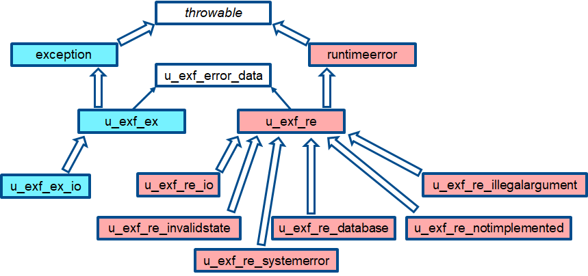

# Informaticon Exception Framework

The Exception Framework (EXF) helps to streamline the management of exceptions/runtimeerrors in PowerBuilder.
In this documentation, the term "exception" is used to describe as well exceptions as runtimeerror.

## Features

* Simplified exception creation
* Meaningful and userfriendly error messages
* Additional error types which allow to store arbitrary data (context information)
* Automatic stack trace determination

## Screenshot


## Usage

You can find a more detailed documentation in German [here](docs/RADME.md).  
To use the exception framework, you have to instantiate it globally in your application object:

```powerbuilder
// Global variables
u_exf_error_manager gu_e

// open() event
gu_e = create u_exf_error_manager
```

### Throwing an exception

```powerbuilder
throw(gu_e.iu_as.of_ex(gu_e.of_new_error() &
    .of_push(populateerror(0, 'Connection timed out')) &
))
```

### Add context

You can store every possible value in an exception.
Some are automatically serialised, for others you have to extend `u_exf_application_adapter.of_parse_to_blob()`.

```powerbuilder
datastore lds
string ls_description
u_my_class lu
//...

throw(gu_e.iu_as.of_ex(gu_e.of_new_error() &
    .of_push(populateerror(0, 'Connection timed out')) &
    .of_push('description', ls_description) &
    .of_push('lu', lu) &
    .of_push('lds', lds) &
))
```

### Catch and display an exception

```powerbuilder
try
    //...
catch(u_exf_ex lu_e)
    gu_e.of_display()
end try
```

### Translation / Customisation

The idea is not to change EXF classes directly, but to use an adapter object to override certain behaviour.
For this, you have to implement an adapter class derived from `u_exf_application_adapter` and register it during application startup:

```powerbuilder
// open() event, after gu_e = create u_exf_error_manager
u_demo_exf_adapter lu_adapter
lu_adapter = create u_demo_exf_adapter

gu_e.of_set_app_adapter(lu_adapter)
```

There are several predefined functions which you can override, the most important are:

| function | purpose |
| ------------- | ------------- |
| of_get_text | Translation, is called for each text displayed by EXF (e.g. 14947->'Cancel'). |
| of_parse_to_blob  | Is called whenever EXF wants to serialize an object (toString-function). |
| of_spawn_window  | Is called whenever EXF wants to display a window. |

### Built-in exception types



blue=checked exceptions (must be caught)  
red=unchecked exceptions (aka runtime errors)

| class | description |
| ------------- | ------------- |
| exception | Predefined exception of the PowerBuillder |
| u_exf_ex | Default checked exception of EXF, you should use this instead of exception |
| u_exf_ex_io | Expected error during input and output (e.g. if fileopen() fails) |
| u_exf_ex_pbni | PowerBuilder Extensions (functions in C++) can/should throw this exception type (see Informaticon PBNI Framework) |
| u_exf_ex_webrequest | Errors that can occur when sending, receiving and processing requests in Internet protocols such as HTTP, HTTPS, FTP etc. |
| runtimeerror | Predefined unchecked exception of the PowerBuilder |
| u_exf_re | Unchecked exception of the EXF, you should use this instead of runtimeerror |
| u_exf_re_database | Database error or error in a Datawindow or Datastore |
| u_exf_re_illegalargument | Can be thrown if the arguments passed to a function do not meet the requirements (e.g. if an argument is unauthorised NULL, or a long must not be <= 0) |
| u_exf_re_invalidstate | Can be thrown if an object has entered an invalid (inconsistent) state
| u_exf_re_io | Unexpected error during input and output (e.g. if fileclose() fails) |
| u_exf_re_notimplemented | For the implementation of abstract classes (e.g. you want to force the developer to overwrite a certain function and therefore throw such an unchecked exception in the base class) |
| u_exf_re_systemerror | Should only be thrown in the application's systemerror event |

## How to build

### Requirements
* PowerBuilder Compiler (pbcXXX.exe and orcascrXXX.exe)
* Make ([direct download](https://gnuwin32.sourceforge.net/packages/make.htm) or via [choco](https://community.chocolatey.org/packages/make))
* CMake ([direct download](https://cmake.org/download/) or via [choco](https://community.chocolatey.org/packages/cmake))
* Microsoft Visual C++ Build Tools (e.g. from [MS Visual Studio 2022 Community Edition](https://visualstudio.microsoft.com/de/vs/community/))

### Tasks

Just open a console at the root folder of this project and run `make build`.

You can choose the PB compiler version by setting the PB_VERSION variable:

```powershell
make build PB_VERSION=170
```

## How to contribute

Please read [CONTRIBUTING.md](CONTRIBUTING.md) before sending a pull request.


## Related work

Part of the code for the stacktrace function was kindly made available under the MIT licence by [Jeremy Lakeman](https://github.com/lakeman/fastfuncs).
